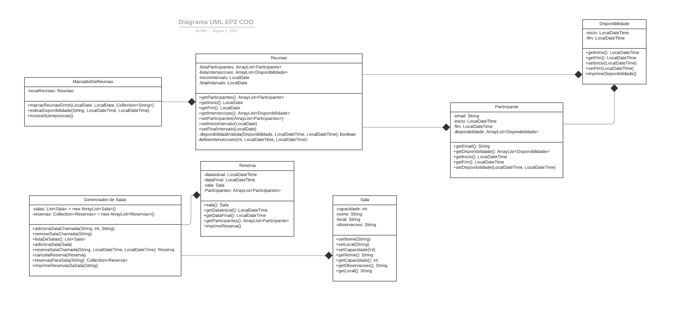

<style>
    * {
        font-family: "Times New Roman", Times, serif;
    }
    h1, h2, h3 {
        text-align: center;
    }
</style>

# ACH2003 - Computação Orientada a Objetos
### Jeniffer Florinda Martins da Silva, nusp **10377966**

<hr>

### GERENCIADOR DE SALAS PARA O MARCADOR DE REUNIÕES

Este exercício programa foi feito em Java

```bash
    java -version:

    openjdk version "1.8.0_272"
    OpenJDK Runtime Environment (build 1.8.0_272-8u272-b10-0+deb9u1-b10)
    OpenJDK 64-Bit Server VM (build 25.272-b10, mixed mode)
```

Para compilar:
```bash
    make
```

Para executar:
```bash
    java <arquivo_main_contendo_implementacao>
```

**DIAGRAMA UML DO PROGRAMA**



**Funcionamento do programa**

Para marcar uma reunião entre uma lista de participantes pode-se utilizar a classe `MarcadorDeReuniao`
e o metodo `marcarReuniaoEntre`, passando o período da reunião e a lista de participantes.

Para descobrir qual o melhor horário para a reunião é preciso inserir a disponibilidade dos participantes,
utilizando o método `indicaDisponibilidadeDe` da classe `MarcadorDeReuniao`.
Após isso, chamando o método `mostraSobreposicao` é possível saber qual a intersecção dos horários disponíveis dos participantes.

Em um cenário de exemplo onde queremos realizar uma reunião entre Paulo, Joana e Camila, inserimos suas disponibilidades e chamamos o método `mostraSobreposicao` temos o seguinte output:

```bash
    ---------------------------------------------
    paulo@gmail.com

    Períodos disponíveis:
    De 01/01/2021 08:30 até 01/01/2021 10:00
    ----------------------------------------------

    ---------------------------------------------
    joana@outlook.com

    Períodos disponíveis:
    De 01/01/2021 09:00 até 01/01/2021 17:00
    De 03/01/2021 11:00 até 03/01/2021 13:00
    De 03/01/2021 15:00 até 03/01/2021 17:00
    ----------------------------------------------

    ---------------------------------------------
    camila@gmail.com

    Períodos disponíveis:
    De 02/01/2021 01:00 até 02/01/2021 23:00
    De 01/01/2021 09:30 até 01/01/2021 16:30
    De 03/01/2021 12:30 até 03/01/2021 15:30
    ----------------------------------------------

    HORÁRIOS DISPONÍVEIS PARA TODES: 
    De 01/01/2021 09:30 até 01/01/2021 10:00
```

Após termos as informações para uma reunião ideal, podemos marcar a reunião e reservar uma sala para tal.
Isso será possível usando a classe `gerenciadorDeSalas`, com o metodo `adicionaSalaChamada` e `reservaSalaChamada`.

Ao reservarmos uma sala para o dia 01/01/2021 entre 09:30 e 10:00 e com o nome "Reunião sobre EP2 de COO"
e com uma descrição, ao imprimir as reservas da sala com o método `imprimeReservasDaSala` temos o 
seguinte output:


```
    ---------------------------------------------
    Reunião sobre EP2 de COO
    Capacidade máxima da sala: 5 participantes.
    Descrição: Precisamos iniciar o esqueleto do EP e mapear as classes necessárias para a implementação
    correta do trabalho.
    Horário: 01/01/2021 09:30 - 01/01/2021 10:00
    ---------------------------------------------
```

**Tratamento de excessões**

Caso o usuário tente marcar uma reunião sem participantes cadastrados, é lançada uma excessão e uma
mensagem de erro. O mesmo acontece se tentar mostrar os horários disponíveis sem registrar a
disponibilidade dos participantes ou sem antes marcar uma reunião dentro de um período.

Outro caso de erro é tentar adicionar duas salas com o mesmo nome. Isso não será possível e o usuário receberá uma mensagem de erro indicando a existência de outra sala com o mesmo nome.


**Executando o main.java de exemplo**

No zip enviado é possível encontrar um exemplo de main.java de exemplo para o EP.

Para executar esse main de exemplo, rode:

```bash 
    java main
```

A saída desse main deverá ser:

```bash
    ---------------------------------------------
    paulo@gmail.com

    Períodos disponíveis:
    De 01/01/2021 08:30 até 01/01/2021 10:00
    ----------------------------------------------

    ---------------------------------------------
    joana@outlook.com

    Períodos disponíveis:
    De 01/01/2021 09:00 até 01/01/2021 17:00
    De 03/01/2021 11:00 até 03/01/2021 13:00
    De 03/01/2021 15:00 até 03/01/2021 17:00
    ----------------------------------------------

    ---------------------------------------------
    camila@gmail.com

    Períodos disponíveis:
    De 02/01/2021 01:00 até 02/01/2021 23:00
    De 01/01/2021 09:30 até 01/01/2021 16:30
    De 03/01/2021 12:30 até 03/01/2021 15:30
    ----------------------------------------------

    HORÁRIOS DISPONÍVEIS PARA TODES: 
    De 01/01/2021 09:30 até 01/01/2021 10:00

    >> RESERVA DA SALA 'Reunião sobre EP2 de COO' EXECUTADA COM SUCESSO!
    >> RESERVA DA SALA 'Reunião sobre EP2 de COO' EXECUTADA COM SUCESSO!
    >> RESERVA DA SALA 'WatchParty comemoração férias.' EXECUTADA COM SUCESSO!
    ---------------------------------------------
    Reunião sobre EP2 de COO
    Capacidade máxima da sala: 5 participantes.
    Descrição: Precisamos iniciar o esqueleto do EP e mapear as classes necessárias para a implementação correta do trabalho.
    Horário: 01/01/2021 09:30 - 01/01/2021 10:00
    ---------------------------------------------
    ---------------------------------------------
    Reunião sobre EP2 de COO
    Capacidade máxima da sala: 5 participantes.
    Descrição: Precisamos iniciar o esqueleto do EP e mapear as classes necessárias para a implementação correta do trabalho.
    Horário: 01/01/2021 09:30 - 01/01/2021 10:00
    ---------------------------------------------
    ---------------------------------------------
    WatchParty comemoração férias.
    Capacidade máxima da sala: 150 participantes.
    Descrição: Finalmente férias!!!! Precisamos comemorar
    Horário: 02/08/2021 18:30 - 02/08/2021 22:00
    ---------------------------------------------
```